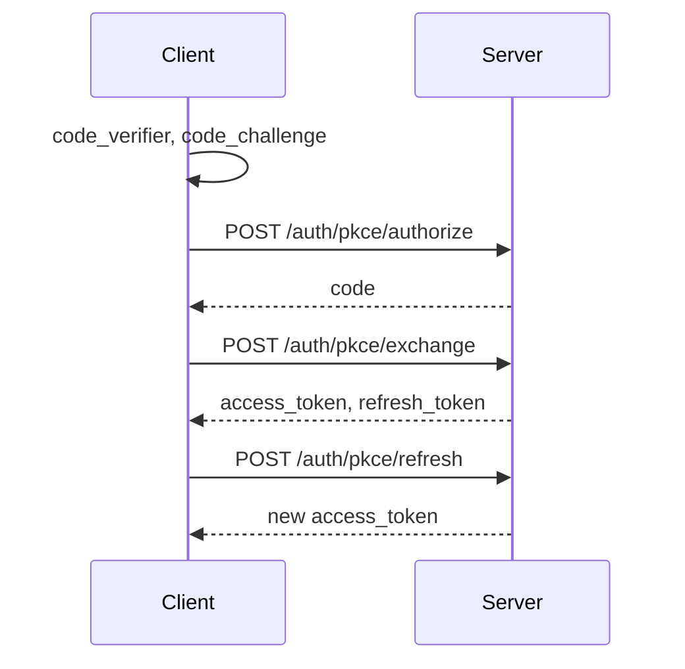

# Credential PKCE authentication

Public clients (desktop apps, CLI tools) cannot store a client secret or rely on the browser `refreshToken` cookie. This flow lets those clients sign in with email and password using [PKCE](https://datatracker.ietf.org/doc/html/rfc7636) and receive JWT access and refresh tokens in JSON.

Cookie-based login (`POST /api/v1/auth/login`) and Google OAuth (`GET /api/v1/auth/google`) are unchanged and separate from this flow.

## Overview

1. The client generates a random **code verifier** and sends `BASE64URL(SHA256(verifier))` as `code_challenge` with the user's credentials.
2. The server validates credentials and returns a one-time **authorization code** (valid for 2 minutes).
3. The client exchanges the code and the original **code verifier** for tokens via `POST /pkce/exchange`.
4. The client refreshes the access token with `POST /pkce/refresh`.



## PKCE parameters

| Parameter | Description |
|-----------|-------------|
| `code_verifier` | High-entropy random string, 43–128 characters (RFC 7636). Keep secret until the token exchange. |
| `code_challenge` | `BASE64URL(SHA256(code_verifier))` with no padding. |
| `code_challenge_method` | Must be `S256`. The `plain` method is not supported. |

### Example (Node.js)

```javascript
import { createHash, randomBytes } from 'crypto';

const codeVerifier = randomBytes(32).toString('base64url');
const codeChallenge = createHash('sha256').update(codeVerifier).digest('base64url');
```

## Endpoints

Base path: `/api/v1/auth`

### `POST /pkce/authorize`

Request JSON:

| Field | Required | Description |
|-------|----------|-------------|
| `email` | yes | User email |
| `password` | yes | User password |
| `code_challenge` | yes | S256 challenge |
| `code_challenge_method` | yes | Must be `S256` |

Success (`200`):

```json
{
  "code": "<one-time-authorization-code>",
  "expires_in": 120
}
```

No `Set-Cookie` header is returned.

Errors (same semantics as `POST /auth/login` where applicable):

| Status | Condition |
|--------|-----------|
| `401` | Missing fields, invalid email, unknown email, wrong password, unverified account (`verifyEmail: true`), Google-only account |
| `400` | `code_challenge_method` is not `S256` |
| `429` | Login rate limit exceeded |

### `POST /pkce/session`

For a browser that is already signed in. Requires the `refreshToken` cookie and `Authorization: Bearer <access_token>` (same as other protected routes).

Request JSON:

| Field | Required | Description |
|-------|----------|-------------|
| `code_challenge` | yes | S256 challenge |
| `code_challenge_method` | yes | Must be `S256` |

Success (`200`): same `{ code, expires_in }` body as `/pkce/authorize`. Does not replace the website session.

| Status | Condition |
|--------|-----------|
| `400` | Missing challenge or method is not `S256` |
| `401` / `498` | Missing or expired website session |
| `429` | Login rate limit exceeded |

### `POST /pkce/exchange`

Request JSON:

| Field | Required | Description |
|-------|----------|-------------|
| `code` | yes | Code from authorize |
| `code_verifier` | yes | Original verifier |
| `redirect_uri` | no | Required only when the code was issued with a redirect binding (future OAuth) |

Success (`200`):

```json
{
  "access_token": "<jwt>",
  "refresh_token": "<jwt>",
  "token_type": "Bearer",
  "expires_in": 300
}
```

Errors:

| Status | Condition |
|--------|-----------|
| `400` | Missing `code` or `code_verifier` |
| `401` | Invalid or expired code, verifier mismatch, reused code |
| `429` | Strict rate limit exceeded |

### `POST /pkce/refresh`

Request JSON:

| Field | Required | Description |
|-------|----------|-------------|
| `refresh_token` | yes | Refresh JWT from exchange (or a prior refresh response) |

Success (`200`): same shape as exchange (`access_token`, `refresh_token`, `token_type`, `expires_in`). The refresh token string is unchanged.

Errors:

| Status | Condition |
|--------|-----------|
| `400` | Missing `refresh_token` |
| `401` | Invalid refresh token |
| `429` | Default rate limit exceeded |

Use the access token as `Authorization: Bearer <access_token>` on protected API routes. A valid bearer token is enough; PKCE clients do not send a refresh cookie.

## Token lifetimes

| Artifact | Lifetime |
|----------|----------|
| Authorization code | 120 seconds, single use |
| Access token | 5 minutes |
| Refresh token | 1 day |

`POST /pkce/refresh` returns a new access token. The refresh token is **not** rotated on refresh.

## Calling the API

After exchange, send:

```http
Authorization: Bearer <access_token>
```

Protected routes accept `Authorization: Bearer <access_token>` without a `refreshToken` cookie. Website clients still send that cookie along with the bearer token. An expired or invalid access token returns `498`; refresh it with `POST /pkce/refresh`. A request with neither a cookie nor a bearer token returns `401`.

## Desktop app (browser handoff)

The SkyDock desktop agent is a PKCE public client:

1. The agent generates `code_verifier`, S256 `code_challenge`, and `state`, then opens the web app at `/login` with `redirect_uri=skydock://callback`.
2. The user signs in on the website (or continues an existing session). The login page calls `POST /auth/pkce/session` and redirects the browser to `skydock://callback?code&state`.
3. Electron receives the custom-scheme URL and forwards `code` and `state` to the agent over the local ZMQ channel.
4. The agent calls `POST /auth/pkce/exchange` with `code` and `code_verifier`. It does **not** send `redirect_uri`, because session-issued codes store `redirectUri` as null.

The agent stores the refresh token in the OS keychain and keeps the access token in memory. It refreshes via `POST /auth/pkce/refresh` and calls protected routes with `Authorization: Bearer` only.

See [the web PKCE doc](../../web/docs/pkce.md) for the login-page behavior.

## Planned: OAuth authorization endpoint

Not available yet: `GET /auth/pkce/authorize` with `client_id`, `redirect_uri`, and `state` for third-party clients, with `redirect_uri` enforced at exchange time on codes that store a non-null `redirectUri`.
