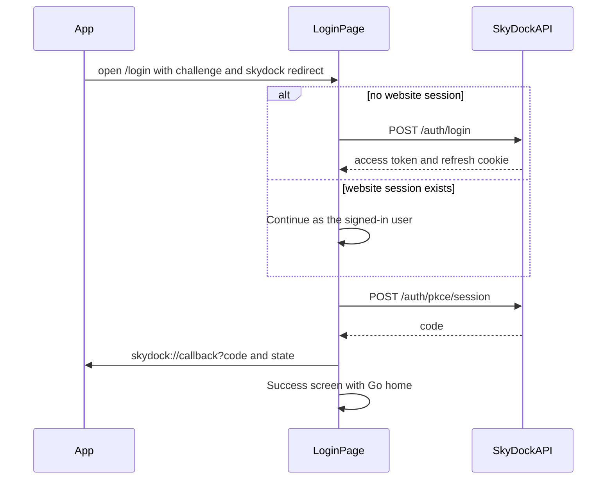

# App sign-in on the login page

The desktop app opens the SkyDock website so the user can sign in in the browser. After a successful login, the page redirects the browser to a `skydock://` URL with a one-time authorization code. The app exchanges that code for tokens. Token exchange is documented in [the server PKCE doc](../../server/docs/pkce.md).

A normal visit to `/login` is unchanged: email and password (or Google) sign the user into the website.

## URL the app opens

```
/login?code_challenge=<S256 challenge>&code_challenge_method=S256&redirect_uri=skydock://callback&state=<opaque>
```

| Query param | Required | Description |
|-------------|----------|-------------|
| `code_challenge` | yes | `BASE64URL(SHA256(code_verifier))`. The verifier stays in the app until token exchange. |
| `code_challenge_method` | yes | Must be `S256`. |
| `redirect_uri` | yes | Must use the `skydock:` scheme. `http` and `https` are rejected. |
| `state` | no | Returned unchanged on the redirect so the app can match the request. |

Example:

```
http://localhost:5173/login?code_challenge=E9Melhoa2OwvFrEMTJguCHaoeK1t8URWbuGJSstw-cM&code_challenge_method=S256&redirect_uri=skydock%3A%2F%2Fcallback&state=af0ifjsldkj
```

Parsing and the redirect allowlist live in [`src/components/Auth/pkceAppLogin.ts`](../src/components/Auth/pkceAppLogin.ts). If any PKCE param is present but the challenge, method, or redirect is invalid, the login card shows an error and does not sign the user into the website.

## What the page does



Google sign-in is hidden while PKCE params are present. The Google callback does not return a PKCE code.

### Already signed in

On load, the page calls `GET /auth/refresh` with the existing cookie. If that succeeds, it loads the user and shows **Continue as {name}**.

Continue calls `POST /auth/pkce/session` with `code_challenge` and `code_challenge_method`, then redirects. The page stays on a success screen with **Go home**, which opens the website. The website session is left in place.

**Use a different account** shows the email and password form. Submitting it replaces the website session with that account, then issues the code the same way.

### Signed out

The form uses the normal `POST /auth/login`. The access token is stored and the refresh cookie is set, so the website stays signed in. The page then calls `POST /auth/pkce/session`, redirects to the app, and shows the same success screen.

A login without PKCE params shows that success screen instead of opening the app. **Go home** navigates to `/`.

## Redirect back to the app

```
skydock://callback?code=<one-time-code>&state=<same state>
```

`code` expires in 2 minutes and can be used once. The app sends it with the original `code_verifier` to `POST /api/v1/auth/pkce/exchange`.

## Code map

| Piece | Role |
|-------|------|
| [`Signin.tsx`](../src/components/Auth/Signin.tsx) | Chooses continue, password login, or normal website login |
| [`pkceAppLogin.ts`](../src/components/Auth/pkceAppLogin.ts) | Reads the query string and builds the `skydock://` return URL |
| [`userAuthApi.ts`](../src/redux/apis/userAuthApi.ts) | `refreshSession` and `pkceSession` mutations |
