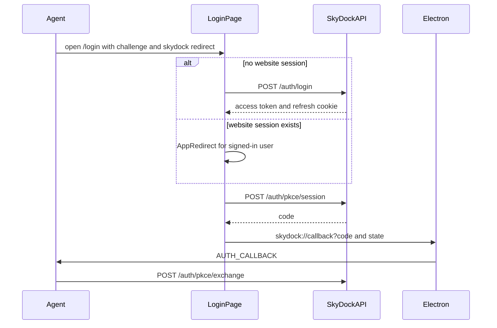

# App sign-in on the login page

The desktop app opens the SkyDock website so the user can sign in in the browser. After a successful login, the page redirects the browser to a `skydock://` URL with a one-time authorization code. The **agent** (Go `agent-service`) exchanges that code for tokens. Token exchange is documented in [the server PKCE doc](../../server/docs/pkce.md).

The agent generates the PKCE `code_verifier`, S256 `code_challenge`, and `state`. The login page never sees the verifier.

A normal visit to `/login` is unchanged: email and password (or Google) sign the user into the website.

## URL the app opens

```
/login?code_challenge=<S256 challenge>&code_challenge_method=S256&redirect_uri=skydock://callback&state=<opaque>
```

| Query param | Required | Description |
|-------------|----------|-------------|
| `code_challenge` | yes | `BASE64URL(SHA256(code_verifier))`. The verifier stays in the agent until token exchange. |
| `code_challenge_method` | yes | Must be `S256`. |
| `redirect_uri` | yes | Must use the `skydock:` scheme. `http` and `https` are rejected. |
| `state` | no | Returned unchanged on the redirect so the agent can match the request. |

Example:

```
http://localhost:5173/login?code_challenge=E9Melhoa2OwvFrEMTJguCHaoeK1t8URWbuGJSstw-cM&code_challenge_method=S256&redirect_uri=skydock%3A%2F%2Fcallback&state=af0ifjsldkj
```

Parsing and the redirect allowlist live in [`useGetPkceParams.ts`](../src/components/hooks/useGetPkceParams.ts). If any PKCE param is present but the challenge, method, or redirect is invalid, the login card shows an error and does not sign the user into the website.

## What the page does



Google sign-in is hidden while PKCE params are present. The Google callback does not return a PKCE code.

### Already signed in

On load, the page calls `GET /auth/refresh` with the existing cookie. If that succeeds, it loads the user and shows [`AppRedirect`](../src/components/Auth/AppRedirect/AppRedirect.tsx):

- **Open in App** — `POST /auth/pkce/session`, then redirect to `skydock://callback?code&state`. Electron forwards `code` and `state` to the agent.
- **Continue on Web** — navigate to `/`. No authorization code is issued.
- **Log in with a different account** — show the email and password form for another user, then the same redirect flow after login.

The website session is left in place when the user opens the app.

### Signed out

The email and password form uses `POST /auth/login`, then `POST /auth/pkce/session`, then the `skydock://` redirect (same as after **Open in App**).

A login without PKCE params does not open the app. After sign-in, the user is sent to `/`.

## Redirect back to the app

```
skydock://callback?code=<one-time-code>&state=<same state>
```

`code` expires in 2 minutes and can be used once. The agent sends it with the original `code_verifier` to `POST /api/v1/auth/pkce/exchange` (no `redirect_uri` for session-issued codes).

## Code map

| Piece | Role |
|-------|------|
| [`Signin.tsx`](../src/components/Auth/Signin.tsx) | PKCE detection, password login, routing to AppRedirect |
| [`AppRedirect.tsx`](../src/components/Auth/AppRedirect/AppRedirect.tsx) | Signed-in handoff UI (**Open in App**, **Continue on Web**) |
| [`pkceAppLogin.ts`](../src/components/Auth/pkceAppLogin.ts) | Builds the `skydock://` return URL |
| [`userAuthApi.ts`](../src/redux/apis/userAuthApi.ts) | `refreshSession` and `pkceSession` mutations |
